# Randomized Controlled Trial, A/B/N Testing, and Multi-Armed Bandit Algorithms

## Introduction

Randomized Controlled Trial (RCT) is the gold standard for establishing causality in experimental methods. It is used widely in clinical trials for new drugs or field experiments in social sciences and economics. In business, especially e-commerce, a related concept is A/B/N Testing. The main idea of RCT and A/B/N test is straightforward: individuals are randomly divided into groups to receive different treatments. Afterwards treatments, outcomes are being evaluated and compared in order to find out which treatment works better/best. In RCT, a control group, where individuals receive a "placebo", is usually included. Note that placebo should be considered as a type of treatment too and individuals who receive a placebo are not getting "nothing". A placebo is something that has no therapeutic effect, i.e., it is not designed to cure a disease or an illness. But it can nevertheless positively impact the well-being of individuals who have received it, if due to nothing but psychological effects. As a result, it would be rather wrong to expect "no effect" from the controlled group that receives the placebo in an RCT.

In the rest of this article, we will refer to the problems we face as A/B/N test instead of RCT. This means we consider tests with 2 or more versions. If you are only comparing two versions, it is an A/B test.

When conducting an A/B/N test, a minimum sample size needs to be determined. The statistical approach to determin the minimum sample size in an A/B/N test is called the "power analysis".

Suppose you have built an e-commerce website with two possible color palettes, and you want to understand which color palette would induce more purchases. You can randomly assign a visitor to the two versions of the website, and after a while, you will have a dataset with two columns: for each visitor, you recorded the version that the visitor was assigned to and the purchases that the visitor made. For $i\in(A,B)$, let's define the following values:
* $\bar{x}_i$: expected dollars spent by visitors of version $i$;
* $n_i$: number of visitors who saw version $i$;
* $s_i$: standard deviation of dollars spent by visitors who saw version $i$.

We can now calculate the "power" as
$$t=\frac{\bar{x}_A-\bar{x}_B}{s_p\sqrt{\tfrac{1}{n_A}+\tfrac{1}{n_B}}}$$
where $s_p=\sqrt{\frac{(n_A-1)s_A^2+(n_B-1)s_B^2}{n_A+n_B-2}}$ is the pooled standard deviation. The "power", $t$, follows a $t$-distribution with $n_A+n_B-2$ degrees of freedom.

Suppose $s_A=s_B$ for the two versions in your A/B test, we can denote the two standard deviations as $s$. Also suppose, for simplicity, you want $n_A=n_B$. You can solve for $n_i$ from the above power analysis formula and obtain:
$$N=\frac{4t^2s^2}{(\bar{x}_A-\bar{x}_B)^2}$$
where $N$ is the total sample size ($n_A+n_B$). It is easy to see that you will need a larger sample size if
* the expected difference between the two versions are smaller;
* you want a better significance level, e.g., 1% instead of 5%;
* the standard deviation is bigger, i.e., dollars spent are more dispersed among individuals;

But here is the problem: you do not know the values of $\bar{x}_i$ and $s_i$ before the experiment. For $\bar{x}_i$, it may be less of an issue. Instead of the expected values, all you really need is the *expected difference*, which can be specified. For example, suppose your website is currently running Version A, and all you care about is that Version B can increase expected purchase amount by 15. In other words, $\bar{x}_B-\bar{x}_A=15$. But you still need to know the standard deviations. How? Some suggest that you can run a short trial to estimate the standard deviation. But then, isn't the A/B test already a trial itself?

Here is another problem about classic A/B test design. Suppose, according to the aforementioned power analysis, an A/B test needs to be ran for at least 3 months. But after 1 month, version B has already outperformed version A by a wide margin. Could we have declared version A is better then? According to classic A/B test design, the answer is "No" because we should not be "peeking" as the difference can be driven by random factors happened only in the first month of the experiment.

Now think about clinical trials for a new drug, where the "no peeking" rule can raise serious concerns. If a drug has proved its effectiveness in the first 500 patients, yet the power analysis tells you that you need to test it on 50,000 patients, what would you do? Isn't it unethical to continue to give a placebo to individuals who may benefit from the actual drug?

The approaches discussed in this chapter do not suffer from the above problems. Here is a brief overview of how these algorithms work. Instead of having a predetermined sample size, the A/B test is deployed in real-time. Continued with our example of a website with two color palettes, a visitor is randomly assigned to a version of the website on the first visit. An algorithm will then pick a version for a visitor. In general, the version that has received higher purchase values should get more visitors. But how do we know which one gives the higher payoff? Here, we face the Explore-Exploit Trade-off.

## The Explore-Exploit Tradeoff

In a nutshell, the explore-exploit tradeoff shows the following paradox: in order to find the best version, you need to explore, which means that the outcome of exploration necessarily improves the more you different versions. However, to maximize total payoff, you want to stick with the best version once (you think) you have found it, which is to exploit. This means that the outcome of exploitation necessarily deteriorates the more you different versions since there is one and only one best version.

How to handle the explore-exploit tradeoff constitutes the core difference among algorithms. Some algorithms, such as variants of the "greedy" family, really focuses on exploitation. The disadvantage is that such algorithm can easily "saddle" into the second-best as long as the second-best is "good enough", as we will show later when we discuss the `Epsilon Greedy` algorithm. Others, such as `Upper Confidence Bound`, put more emphasis on exploration, at least initially.

If you are reading this article because you think it may help you with your research project(s), you are not a stranger to the explore-exploit trade-off. Have you moved on from a project because you did not think it was promising, only to discover later that someone else has published a paper in a top journal with a similar idea? In such case, you may have explored more than the optimum.

## Epsilon Greedy

We will begin our in-depth discussion of algorithms with `Epsilon Greedy`. For each algorithm, we aim to provide:
* intuition and description of theory
* pseudocode
* `Python` code

Algorithms in the `Greedy` family applies a simple logic: choose the version that gives the best *observed* expected payoff. For simplicity, and for the rest of this article, let's consider an e-commerce website that has 5 different designs but sells a single product: an EveryDay-Carry (EDC) musical instrument for 69.99 dollars. If we run an A/B/N test on the web designs, only 2 outcomes are possible from each visitor: buy or not buy.

Here is the pseudocode for a simple `Greedy` algorithm:

```
loop:
    j = argmax(expected bandit win rates)
    x = reward (1 or 0) from playing bandit j
    bandit[j].update_mean(x)
```

I used **bandit** instead of **version** here, and will be using these two terms interchangeably, because the problem we are working on is commonly known as the ``Multi-Armed Bandits`` problem in probability theory and reinforcement learning. The analogy comes from choosing among multiple slot machines in a casino since a single slot machine is referred to as a "one-armed bandit".

Let's take a closer look at the pseudocode. In this pseudocode, $i$ indexes visitor, $j$ indexes the website version (or bandit), and $x$ is 1 when the visitor buys and 0 otherwise. Furthermore, `update_mean()` is a function that takes the new value of `x` and updates the expected payoff for bandit `j`. To update the expected payoff after bandit `j` was played for the $n_{th}$ time, we have

$$\bar{x}_n=\bar{x}_{n-1}+\frac{x_n-\bar{x}_{n-1}}{n}$$

This calculates the mean in *constant time and memory*, i.e., it requires only 3 values to calculate the mean, $\bar{x}_n$, regardless of the value of $n$: $\bar{x}_{n-1}$, $x_n$, and $n$, whereas the number of values required to calculate the mean with the formula

$$\bar{x}_n=\frac{\sum_{i=1}^n{x_i}}{n}$$

increases with $n$.

While not necessary, it can sometimes be a good idea to try all versions in the beginning. For example, for the first 50 visitors, we can send them to each design with equal probability. From that point on, the algorithm finds the version that gives the best expected payoff, and play that version.

It should be obvious that the simple `Greedy` algorithm has a problem: once it finds a bandit with a *high enough* payoff, it rarely switches. In other words, it almost never explores. The `Epsilon Greedy` algorithm provides a simple fix:

```
loop:
    p = random number in [0, 1]
    if p < epsilon:
        j = choose a bandit at random
    else:
        j = argmax(expected bandit win rates)
    x = reward (1 or 0) from playing bandit j
    bandit[j].update_mean(x)
```

As the pseudocode shows, a random value is drawn when a new visitor has arrived. If the random value is smaller than the threshold, `epsilon`, set before the start of the experiment, then a random bandit is picked. Note that this randomly picked bandit can be the same as the one picked by `argmax`. To exclude such case only requires a few more lines of code. However, this is not a requirement of the `Epsilon Greedy` algorithm and the benefit of doing so is not obvious.

Let's now move onto the actual implementation of `Epsilon Greedy` in `Python`. Note that the script includes lines with the comment "*only in demonstration*". These are codes to generate the *true* win rate of different bandits, which you do not know when running a real-world experiment. This also means you can not use the scripts here in real-world problems without making necessary changes.

```python
import numpy as np
import random

# set the number of bandits
N_bandits = 5
# set the number of trials
# only in demonstration
N = 100000


class BayesianAB:
    def __init__(
            self,
            number_of_bandits: int = 2,
            number_of_trials: int = 100000,
            p_max: float = .75,
            p_diff: float = .05,
            p_min: float = .1
    ):
        if p_min > p_max - p_diff:
            raise ValueError("Condition p_min < p_max - p_diff not satisfied. Exit...")

        self.prob_true = [0] * number_of_bandits  # only in demonstration
        self.prob_win = [0] * number_of_bandits
        self.history = []
        self.history_bandit = []  # for Monte Carlo
        self.count = [0] * number_of_bandits  # only in demonstration
        # preference and pi are for gradient_bandit only
        self.pref = [0] * number_of_bandits
        self.pi = [1 / number_of_bandits] * number_of_bandits
        # a and b are for bayesian_bandits only
        self.alpha = [1] * number_of_bandits
        self.beta = [1] * number_of_bandits
        # number of trials/visitors
        self.N = number_of_trials

        # set the last bandit to have a win rate of 0.75 and the rest lower
        # only in demonstration
        self.prob_true[-1] = p_max
        for i in range(0, number_of_bandits - 1):
            self.prob_true[i] = round(p_max - random.uniform(p_diff, p_max - p_min), 2)

    # Receives a random value of 0 or 1
    # only in demonstration
    def pull(
            self,
            i,
    ) -> bool:
        return random.random() < self.prob_true[i]

    # Updates the mean
    def update(
            self,
            i,
            k,
    ) -> None:
        outcome = self.pull(i)
        # may use a constant discount rate to discount past
        self.prob_win[i] = (self.prob_win[i] * k + outcome) / (k + 1)
        self.history.append(self.prob_win.copy())
        self.history_bandit.append(i)  # for Monte Carlo
        self.count[i] += 1

    ####################
    # epsilon greedy
    def epsilon_greedy(
            self,
            epsilon: float = 0.5,
    ):

        self.history.append(self.prob_win.copy())

        for k in range(1, self.N):
            if random.random() < epsilon:
                i = random.randrange(0, len(self.prob_win))
            else:
                i = np.argmax(self.prob_win)

            self.update(i, k)

        return self.history
```

Let's break it down. First, we import two libraries: `numpy` and `random`. We will be using functions from these libraries such as `argmax()` from `numpy` and `randrange()` from `random`:

```python
import numpy as np
import random
```

We then set three global parameters:

```python
# set the number of bandits
N_bandits = 5
# set the number of trials/visitors
N = 100000
```

In practice, the value of `N_bandits` depends on the number of versions your experiment is set out to test, and the number of visitors, `N`, is unknown.

In this script, we are creating a class named `BayesianAB`, and put all the algorithms we cover in this article under `BayesianAB`. We initiate the class with the following values:

```python
class BayesianAB:
    def __init__(
            self,
            number_of_bandits: int = 2,
            number_of_trials: int = 100000,
            p_max: float = .75,
            p_diff: float = .05,
            p_min: float = .8
    ):
        if p_min > p_max - p_diff:
            raise ValueError("Condition p_min < p_max - p_diff not satisfied. Exit...")

        self.prob_true = [0] * number_of_bandits  # only in demonstration
        self.prob_win = [0] * number_of_bandits
        self.history = []
        self.history_bandit = []  # for Monte Carlo
        self.count = [0] * number_of_bandits  # only in demonstration
        # preference and pi are for gradient_bandit only
        self.pref = [0] * number_of_bandits
        self.pi = [1 / number_of_bandits] * number_of_bandits
        # a and b are for bayesian_bandits only
        self.alpha = [1] * number_of_bandits
        self.beta = [1] * number_of_bandits
        # number of trials/visitors
        self.N = number_of_trials
```

The `BayesianAB` class accepts 5 parameters:
* `number_of_bandits` has a default value of 2;
* `number_of_trials` indicates the number of rounds/visitors, which has a default value of 100,000;
* `p_max` is the highest win rate;
* `p_diff` is the smallest possible difference between the highest win rate and the second highest win rate;
* `p_min` is the lowest possible win rate, andt the condition `p_min > p_max - p_diff` must be met.

The `BayesianAB` class pre-allocates 10 lists to store various values necessary for different tasks:
* `prob_true` stores the *true* win rate of each bandit. These win rates are to be generated next. In practice, you do not know these true win rate values;
* `prob_win` stores the *observed (expected)* win rate of each bandit. Values in this list are to be updated during each round of the experiment;
* `history` stores the history of `prob_win` in each trial/round. This is important for both updating the mean in constant time (see above) and the evaluation of bandit/algorithm performances afterwards;
* `history_bandit` stores the history of what bandit was picked in each trial/round. This is useful when we need to run the Monte Carlo simulation for testbed;
* `count` stores the number of times that each bandit was chosen;
* `pref` and `pi` are values for the `Gradient Bandit` algorithm;
* `alpha` and `beta` are values used in `Thompson Sampling`, the last algorithm to be considered in this article;
* `N` stores the number of trials and is used by each method/algorithm in the `BayesianAB` class.

The following lines generate the *true* win rates:

```python
        # set the last bandit to have a win rate of 0.75 and the rest lower
        # only in demonstration
        self.prob_true[-1] = p_max
        for i in range(0, number_of_bandits - 1):
            self.prob_true[i] = round(p_max - random.uniform(p_diff, p_max - p_min), 2)
```

The last bandit always has the highest win rate, `p_max`, and the rest of them are randomized between `p_min` and `p_max - p_diff`. we used this approach to allow for flexibility in specifying the number of bandits using `N_bandits` (or `number_of_bandits` inside the `BayesianAB` class).

Next, we define two functions used by almost every algorithm:

```python
    # Receives a random value of 0 or 1
    # only in demonstration
    def pull(
            self,
            i,
    ) -> bool:
        return random.random() < self.prob_true[i]

    # Updates the mean
    def update(
            self,
            i,
            k,
    ) -> None:
        outcome = self.pull(i)
        # may use a constant discount rate to discount past
        self.prob_win[i] = (self.prob_win[i] * k + outcome) / (k + 1)
        self.history.append(self.prob_win.copy())
        self.history_bandit.append(i)  # for Monte Carlo
        self.count[i] += 1
```

The first function, `pull()`, returns either True or False depending on if the value of `random.random()` is less than the true win rate of bandit $i$. This is unnecessary in practice. Instead, a call to either the `BayesianAB` class or a specific method (such as `Epsilon Greedy`) inside `BayesianAB` should be triggered with the arrival of a new visitor, and by the end of the visit, you would know if the visitor has purchased (True) or not (False). In `Python`, `True` is given a numerical value of 1 and `False` a value of 0.

The `update()` function updates the mean. It also adds the updated expected win rate to the list `history` and increase the count of bandit $i$ being picked by 1.

Here is the actual method inside `BayesianAB` that implements `epsilon greedy`:

```python
    def epsilon_greedy(
            self,
            epsilon: float = 0.5,
    ):

        self.history.append(self.prob_win.copy())

        for k in range(1, self.N):
            if random.random() < epsilon:
                i = random.randrange(0, len(self.prob_win))
            else:
                i = np.argmax(self.prob_win)

            self.update(i, k)

        return self.history
```

It follows the logic outlined in the pseudocode. Inside the `for` loop, these steps are followed:
1. Checks if a random value is smaller than `epsilon` which can be specified when the `epsilon_greedy()` method is called. `epsilon` also has a default value of $0.5$. If this is `True`, then a random bandit is selected;
2. Otherwise, select the bandit that has the highest expected win rate;
4. Update the mean for the chosen bandit by calling the `update()` function.

The `epsilon_greedy()` method returns the list `history`, which stores the complete history for run as discussed earlier.

To call `epsilon_greedy()` and examine the results, we execute the following:

```python
eg = BayesianAB(N_bandits)
print(f'The true win rates: {eg.prob_true}')
eg_history = eg.epsilon_greedy()
print(f'The observed win rates: {eg.prob_win}')
print(f'Number of times each bandit was played: {eg.count}')
```

Here, we call `epsilon_greedy()` with the default value for `epsilon`. This means the algorithm will explore half of the time. We also print out the true win rates, the expected win rates, and the number of times that each bandit was played. Here is the printed output from a particular run:

```
The true win rates: [0.37, 0.55, 0.67, 0.4, 0.75]
The observed win rates: [0.2062, 0.3354, 0.6717, 0.1953, 0.5526]
Number of times each bandit was played: [10200, 9945, 60001, 9789, 10064]
```

In the above run, the best bandit was NOT the one that was selected the most. The second best bandit, with a 0.67 win rate, was picked about 60% of the time, as dictated by the value of `epsilon`. Such outcome is due to the fact that the bandit with a 0.67 win rate did well in the beginning. Since it is close enough to 0.75, the default win rate of the best bandit, random jumps to the bandit with the 0.75 win rate were not enough to "flip" the results.

Also note that the expected win rates have not converged to the true win rates except for the "chosen" one after 100,000 visitors. However, if the number of visitors approaches infinity, which means that each version would be picked infinite times, all win rates would converge to their true values. This, in turn, means that the best bandit would eventually overtake the second-best if the experiment runs *long enough*. In other words, `Epsilon Greedy` guarantees the identification of the best bandit as $n$ approaches infinity.

We can visualize the outcome from the experiment with the following code:

```python
import pandas as pd
import matplotlib.pyplot as plt
import seaborn as sns


def plot_history(
        history: list,
        prob_true: list,
        k=N,
):
    df_history = pd.DataFrame(history[:k])

    plt.figure(figsize=(20, 5))

    # Define the color palette
    colors = sns.color_palette("Set2", len(prob_true))

    for i in range(len(prob_true)):
        sns.lineplot(x=df_history.index, y=df_history[i], color=colors[i])

    # Create custom legend using prob_true and colors
    custom_legend = [plt.Line2D([], [], color=colors[i], label=prob_true[i]) for i in range(len(prob_true))]
    plt.legend(handles=custom_legend)

```

Then execute:

```python
plot_history(history=eg.history, prob_true=eg.prob_true)
```

Here is the output from the above run:

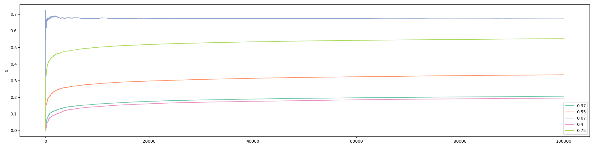

We can also get the visualization for the first 100 visitors, which shows that the third bandit, the a 0.67 win rate, jumped ahead early:

```python
plot_history(history=eg.history, prob_true=eg.prob_true, k=100)
```


## Optimistic Initial Values

The `Optimistic Initial Values` algorithm is one of my favorites (the other being the `Gradient Bandit` algorithm) amongst the algorithms discussed in this article. While `Epsilon Greedy` focused on "exploit" and can end up choosing the second-best version, the `Optimistic Initial Values` algorithm puts more focus on "explore" initially, while staying `greedy`, i.e., pick the strategy that shows the highest expected win rate. The name of this algorithm informs you about what it does: at the start of the experiment, each bandit is set to have a high expected win rate, i.e., we are "optimistic" about each bandit. This ensures that each of them is played a fair number of times initially. If we compare `Epsilon Greedy` to English auctions where the values go up over time, `Optimistic Initial Value` is comparable to Dutch auctions where the values go *down* over time. Here is the pseudocode:

```
p_init = 5 # a large value as initial win rate for ALL bandits

loop:
    j = argmax(expected bandit win rates)
    x = reward (1 or 0) from playing bandit j
    bandit[j].update_mane(x)
```

Assuming you already have the code from the `Epsilon Greedy` section, you can add the following method inside the `BayesianAB` class to run the `Optimistic Initial Values` algorithm:

```python
    ####################
    # optimistic initial values
    def optim_init_val(
            self,
            init_val: float = 0.99,
    ):

        self.prob_win = [init_val] * len(self.prob_win)
        self.history.append(self.prob_win.copy())

        for k in range(1, self.N):
            i = np.argmax(self.prob_win)

            self.update(i, k)

        return self.history
```

The only thing new here is the line that assigns `init_val` to `prob_win` in the beginning. We can execute the following to get results and visualization:

```python
oiv = BayesianAB(N_bandits)
print(f'The true win rates: {oiv.prob_true}')
oiv_history = oiv.optim_init_val(init_val=0.99)
print(f'The observed win rates: {oiv.prob_win}')
print(f'Number of times each bandit was played: {oiv.count}')

# plot the entire experiment history
plot_history(history=oiv.history, prob_true=oiv.prob_true)
```

And following are outcomes from a typical run:

```
The true win rates: [0.6, 0.54, 0.62, 0.14, 0.75]
The observed win rates: [0.6633, 0.7493, 0.7491, 0.7493, 0.7521]
Number of times each bandit was played: [2, 168, 285, 65, 99479]
```

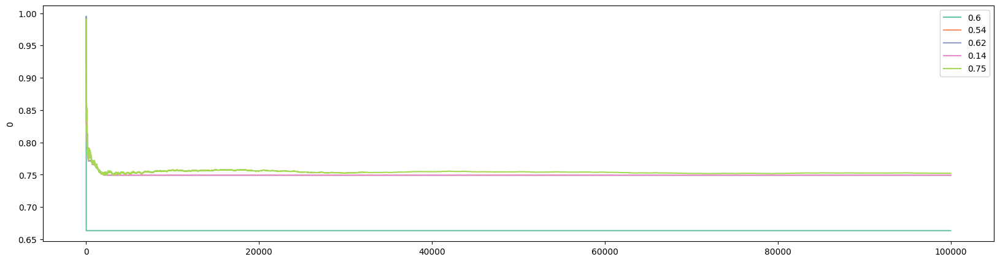

From the visualization below, you can see that the best bandit jumped ahead after about merely 15 visitors:

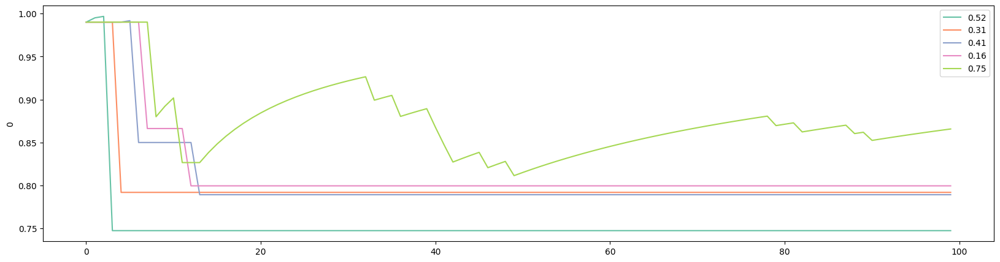

Note that we set `init_val` to 0.99 since we are comparing win rates that can not exceed 1. The larger the initial value, the more the algorithm explores initially. Because the `Optimistic Initial Values` algorithm was specifically designed to explore in the beginning, it can "fall behind" in reaching the best version, if ever, compared to other algorithms such as `Epsilon Greedy`. Note that if the best bandit is discovered early, the expected win rates of other bandits never converge to their true win rates in `Optimistic Initial Values` (but would in `Epsilon Greedy`). This is a common feature of several of the algorithms discussed in this article.

## Upper Confidence Bound (UCB)

The theory of `UCB` is harder to fully grasp although its intuition and implementation are straightforward. To start, let's look back to the last two algorithms that we have discussed: `Epsilon Greedy` and `Optimistic Initial Values`. A common step in the implementation of both of these algorithms is to find the bandit that gives the best *observed* expected win rate. This is why both algorithms are said to be `greedy`. But can we do better, especially that we know these expected win rates are probabilistic? Put differently, we know that the more a certain bandit was selected, the closer its expected win rate is to its true win rate. But what about those bandits that were rarely picked?

That is where `Upper Confidence Bound` comes into play. The idea is that we should not be relying on the observed expected win rates alone in making decisions. We should give each version some "bonus points": if a version has been picked a lot, it gets a small bonus; but if a version has barely been barely chosen, it should get a larger bonus because, probabilistically, the observed expected win rate *can* be far from the true win rate if a version has not been played much.

If you are interested in the math, you can read the paper "[Finite-time Analysis of the Multiarmed Bandit Problem](https://homes.di.unimi.it/~cesabian/Pubblicazioni/ml-02.pdf)". In the paper, the authors have outlined a function for the "bonus", which is commonly known as `UCB1`:

$$b_j=\sqrt{\frac{2\log{N}}{n_j}}$$

where $N$ is the total number of visitors at the time of computing the bonus, and $n_j$ is the number of times that bandit $j$ was chosen at the time of computing the bonus. Adding $b$ to the expected win rate gives the **upper confidence bound**:

$$\text{UCB1}_j=\bar{x}_{n_j}+b_j$$

Here is the pseudocode for `UCB1`:

```
loop:
    Update UCB1 values
    j = argmax(UCB1 values)
    x = reward (1 or 0) from playing bandit j
    bandit[j].update_mean(x)
```

Adding the following method into `BayesianAB` will implement `UCB1`:

```python
    ####################
    # upper confidence bound (UCB1)
    def ucb1(
            self,
            c=1,
    ):

        self.history.append(self.prob_win.copy())
        bandit_count = [0.0001] * len(self.prob_win)

        for k in range(1, self.N):
            bound = self.prob_win + c * np.sqrt(np.divide(2 * np.log(k), bandit_count))
            i = np.argmax(bound)

            self.update(i, k)

            if bandit_count[i] < 1:
                bandit_count[i] = 0
            bandit_count[i] += 1

        return self.history
```

This is very similar to what we had before. One thing to note is that we give a very small initial value ($0.0001$) to `bandit_count` to avoid the division of zero in the beginning of the experiment. Later, we reversed the value to 0 with the `if` statement. An alternative approach is to run the first several iterations on all versions before implementing `UCB1` thereafter.

`UCB1` has a parameter, $c$, which controls the degree of exploration. Other things being equal, A larger value $c$ means a higher reward. The default value is set to 1 in the above script.

Executing the following will give us results and visualization for `UCB1`:

```python
ucb = BayesianAB(N_bandits)
print(f'The true win rates: {ucb.prob_true}')
ucb_history = ucb.ucb1()
print(f'The observed win rates: {ucb.prob_win}')
print(f'Number of times each bandit was played: {ucb.count}')

# plot the entire experiment history
plot_history(history=ucb.history, prob_true=ucb.prob_true)
```

A typical run gives the following:

```
The true win rates: [0.65, 0.12, 0.63, 0.33, 0.75]
The observed win rates: [0.6505, 0.1165, 0.1928, 0.0774, 0.3794]
Number of times each bandit was played: [99470, 77, 103, 67, 282]
```

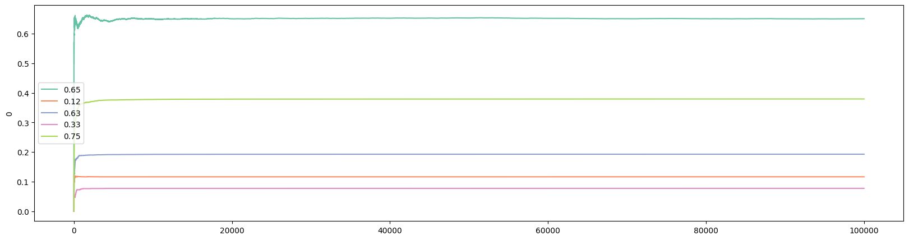

This particular run shows that `UCB1` has also failed to identify the best version. Examining the first 100 visitors shows that the bandit with a .65 win rate jumped out early and never looked back. And the algorithm is not guaranteed convergence even with infinite number of visitors:

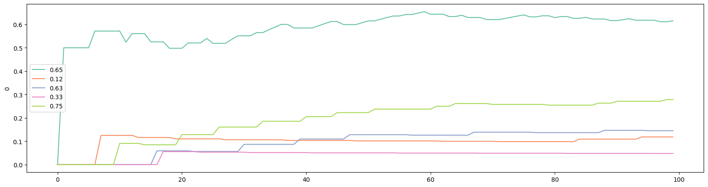

## Gradient Bandit Algorithm

Another algorithm that does not rely *entirely* on expected win rates is the `Gradient Bandit` algorithm. Not surprisingly, this algorithm is related to gradient ascent. With this algorithm, each bandit's probability of being chosen is determined according to a soft-max distribution:

$$\pi_n(i)=\frac{e^{H_n(i)}}{\sum_{j=1}^{J}{e^{H_n(j)}}}$$

where $\pi_n(i)$ is the probability of bandit $i$ being picked for customer $n$, $H_n(i)$ is the *preference* for bandit $i$ at the time customer $n$ arrives, and $J$ is the total number of bandits in the experiment. In the case of only two bandits, this specification is the same as the logistic or sigmoid function.

When the first customer arrives, i.e., $n=1$, it is custom to set the *preference*, $H_1(j)$, for all $j$, to 0 so that every bandit has the same probability of getting picked. Suppose bandit $i$ is picked for customer $n(\geq1)$, then the *preference* for $i$ is updated according to:

$$H_{n+1}(i)=H_n(i)+\alpha(x_n - \bar{x}_{n-1})(1-\pi_n(i))$$

whereas the *preferences* for all $j\neq i$ are updated according to:

$$H_{n+1}(j)=H_n(j)-\alpha(x_n - \bar{x}_{n-1})\pi_n(j)$$

where $\alpha>0$ is a "step-size" parameter.

The intuition of the `Gradient Bandit` algorithm is as follows. When the reward received from picking $i$ for customer $n$ is higher than the expected reward, the probability of picking $i$ in the future (next round) is increased. In our simple case with only two outcomes (buy and not buy), the reward is higher than the expected reward only if customer $n$ buys.

Let's take a look at the pseudocode:

```
H = [0] * number_of_bandits

loop:
  pi = pi(H) # Calculates the soft-max distribution
  i = random.choices(bandits, weights=pi)
  gb.update()
```

where `H.update()` updates the values of $H(i)$ (the bandit that was chosen) and $H(j)$ (bandits that were not chosen).

Here is the `Python` implementation for `Gradient Bandit`:

```python
    ####################
    # gradient_bandit update
    def gb_update(
            self,
            i,
            k,
            a,
    ):

        outcome = self.pull(i)
        for z in range(len(self.pref)):
            if z == i:
                self.pref[z] = self.pref[z] + a * (outcome - self.prob_win[z]) * (1 - self.pi[z])
            else:
                self.pref[z] = self.pref[z] - a * (outcome - self.prob_win[z]) * self.pi[z]

        self.prob_win[i] = (self.prob_win[i] * k + outcome) / (k + 1)

        return self.pref

    # gradient bandit algorithm
    def gradient_bandit(
            self,
            a=0.2,
    ):

        self.history.append([self.pi.copy(),
                             self.pref.copy(),
                             self.prob_win.copy()])

        for k in range(1, self.N):
            self.pi = np.exp(self.pref) / sum(np.exp(self.pref))
            pick = random.choices(np.arange(len(self.pref)), weights=self.pi)
            i = pick[0]
            self.pref = self.gb_update(i, k, a)

            self.count[i] += 1
            self.history.append([self.pi.copy(),
                                 self.pref.copy(),
                                 self.prob_win.copy()])
            self.history_bandit.append(i)  # for Monte Carlo

        return self.history
```

Here are some notes on the `Python` implementation of the `Gradient Bandit` algorithm:
1. We have already initiated `pref` and `pi` at the start of the `BayesianAB` class;
2. As discussed in the pseudocode, a new function, `gb_update()`, is necessary since we need to update the preference function for every bandit in each round;
3. The `gradient_bandit()` function takes 1 parameter: $a$, which is the step-size parameter. The default value of $a$ is set to 0.2. The smaller the value of $a$, the more the algorithm explores;
4. `gradient_bandit()` saves `history` differently: each row in `history` is an array of 3 lists. In order to examine the performance of the `Gradient Bandit` algorithm, we not only save the expected win rates, but also preferences and the values from the soft-max distribution, $\pi(i)$;
5. The function `choices()` from the `random` library picks a value from a list based on `weights`. In this case, the weights is given by the soft-max distribution;

Because `gradient_bandit()` saves arrays in `history`, we also need to update the `plot_history()` function:

```python
def plot_history(
        history: list,
        prob_true: list,
        col=2,
        k=N,
):
    if type(history[0][0]) == list:  # To accommodate gradient bandit
        df_history = pd.DataFrame([arr[col] for arr in history][:k])
    else:
        df_history = pd.DataFrame(history[:k])

    plt.figure(figsize=(20, 5))

    # Define the color palette
    colors = sns.color_palette("Set2", len(prob_true))

    for i in range(len(prob_true)):
        sns.lineplot(x=df_history.index, y=df_history[i], color=colors[i])

    # Create custom legend using prob_true and colors
    custom_legend = [plt.Line2D([], [], color=colors[i], label=prob_true[i]) for i in range(len(prob_true))]
    plt.legend(handles=custom_legend)
```

The updates occurred in

```python
    if type(history[0][0]) == list:  # To accommodate gradient bandit
        df_history = pd.DataFrame([arr[col] for arr in history][:k])
    else:
        df_history = pd.DataFrame(history[:k])
```

with the added parameter `col`. This is to accommodate the arrays saved in history by `gradient_bandit()`. The `if` statement checks whether the first element in `history` is a `list`. If it is, then `history` was saved from `gradient_bandit()` and we would need to extract the specific column, given by `col`, for plotting. The default value of `col` is 2, which is to plot the history of the win rates.

Executing the following will run the `Gradient Bandit` algorithm:

```python
# Gradient bandit
gb = BayesianAB(N_bandits)
print(f'The true win rates: {gb.prob_true}')
gb_history = gb.gradient_bandit()
print(f'The observed win rates: {gb.prob_win}')
print(f'Number of times each bandit was played: {gb.count}')

# plot the entire experiment history
plot_history(history=gb.history, prob_true=gb.prob_true)
```

Here are results from a typical run:

```
The true win rates: [0.17, 0.56, 0.17, 0.7, 0.75]
The observed win rates: [0.2564, 0.5514, 0.0105, 0.6636, 0.7498]
Number of times each bandit was played: [35, 67, 22, 196, 99679]
```

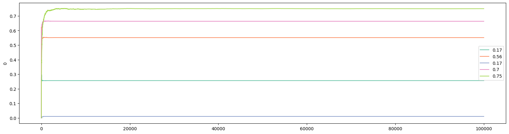

As usual, we can examine what happened after 100 customers. Interestingly, the bandit with the highest win rate did not lead after only 100 customers:

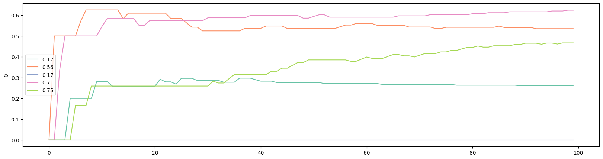

We can plot the evolution of the `preference` with the following:

```python
# plot preference
plot_history(history=gb.history, prob_true=gb.prob_true, col=1)
```

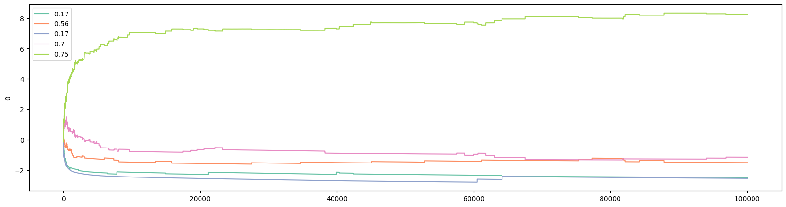

And plot the soft-max function with the following:

```python
# plot pi
plot_history(history=gb.history, prob_true=gb.prob_true, col=0)
```

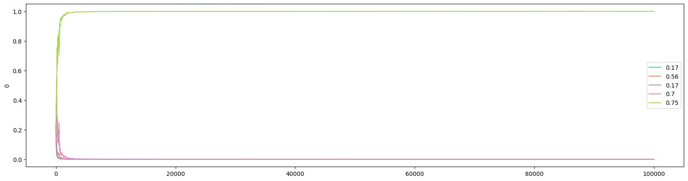

There are several reasons why the `Gradient Bandit` algorithm is one of my favorites:
1. Economists are familiar with the idea of using `preference` to model choices;
2. Economists are familiar with `logistic` function, used in logistic regression, which is the special case of `soft-max` with only two bandits;
3. One of my research areas is conflict and contest, in which the `soft-max` function, known as "contest success function", is widely used in the literature.

## Thompson Sampling (Bayesian Bandits)

`Thompson Sampling`, or `Bayesian Bandits`, takes another (big) step forward. In our discussion on `Upper Confidence Bound`, we acknowledged the fact that using only the expected win rate to represent the performance of a bandit is not accurate. To tackle this, `UCB1` adds a "bonus": the bonus is smaller for the bandits that were played more, and larger for the bandits that were played less. Then in our discussion on `Gradient Bandit`, each bandit's chance of being picked is described by a soft-max distribution.

To push these ideas further, and as the name `Thompson Sampling` has hinted, we ask if we could construct a probability distribution to describe the expected win rates of all the bandits. As it turns out, this is possible, as everything, including parameters, are considered random variables in Bayesian Statistics. For example, with Normal Distribution, we often speak about fixed values of mean and variance. But in Bayesian Statistics, the mean and variance of a Normal Distribution are two random variables and they can be described by probability distributions.

The mathematical derivation of `Thompson Sampling` requires the use of [conjugate prior](https://en.wikipedia.org/wiki/Conjugate_prior), which we will discuss here briefly, before returning to the `Python` implementation of `Thompson Sampling`.

## Conjugate Prior
Recall the Bayes Rule:
$$p(\theta \mid X)=\frac{p(X \mid \theta)p(\theta)}{p(X)}$$
where the four parts are called, respectively
* $p(\theta \mid X)$: Posterior distribution
* $p(X \mid \theta)$: Likelihood function
* $p(\theta)$: Prior probability distribution
* $p(X)$: Evidence

In Bayesian Statistics, if the posterior distribution is in the same probability distribution family as the prior probability distribution, the prior and posterior are then called conjugate distributions, and the prior is called a **conjugate prior** for the likelihood function.

With conjugate priors, the updating in a Bayesian approach reduces to the updates of hyperparameters that are used to describe both the prior and posterior distributions, since they are the same. we will leave the details to a Statistics textbook, but for our purpose, since our example concerns of binary outcomes (buy or not buy), our likelihood function is that of Bernoulli. As it turns out, the conjugate prior for a Bernoulli likelihood function is the Beta distribution, which has two hyperparameters: $\alpha$ and $\beta$.

Now that we have established that Beta distribution is the conjugate prior for Bernoulli, the problem of `Thompson Sampling` is reduced to
1. sample from the Beta distribution
2. find the highest expected value

## Thompson Sampling: Code

Since `Thompson Sampling` is mechanical different from the previous algorithms, we need to develop special functions and methods to implement `Thompson Sampling`. Here is a pseudocode:

```
loop:
    sampling from Beta function for bandit b
    j = argmax(b.sample() for b bandits)
    x = reward (1 or 0) from playing bandit j
    bandit[j].bb_update(x)
```

The function that needs to be added is `bb_update()`. Here is the full `Python` implementation:

```python
from scipy.stats import beta

    ####################
    # bayesian_bandits update
    def bb_update(
            self,
            a,
            b,
            i,
    ):

        outcome = self.pull(i)
        a[i] += outcome
        b[i] += 1 - outcome
        self.count[i] += 1

        return a, b

    # Bayesian bandits
    # For Bernoulli distribution, the conjugate prior is Beta distribution
    def bayesian_bandits(
            self,
            sample_size: int = 10,
    ):

        a_hist, b_hist = [], []
        a_hist.append(self.alpha.copy())
        b_hist.append(self.beta.copy())

        for k in range(1, self.N):
            sample_max = []

            for m in range(len(self.prob_true)):
                m_max = np.max(np.random.beta(self.alpha[m], self.beta[m], sample_size))
                sample_max.append(m_max.copy())

            i = np.argmax(sample_max)

            self.alpha, self.beta = self.bb_update(self.alpha, self.beta, i)
            a_hist.append(self.alpha.copy())
            b_hist.append(self.beta.copy())
            self.history_bandit.append(i)  # for Monte Carlo

        self.history = [a_hist, b_hist]
        return self.history
```

Let's walk through this script:
1. We have already initiated `alpha` and `beta` at the start of the `BayesianAB` class. They are the hyperparameters in the Beta distribution;
2. We import `beta` from `scipy.stats` since the conjugate prior for Bernoulli distribution is the Beta distribution.
3. The function `bb_update()` updates the hyperparameter values based on the outcome from the last visitor for bandit $i$: if the outcome was `True`, then the value of `alpha` increases by 1; otherwise, the value of `beta` increases by 1.

For the actual implementation of the `Bayesian Bandits` in the `bayesian_bandits()` method, it is largely consistent with what we have been doing in other algorithms. The main differences include:
1. Instead of storing the history of outcomes, we store the history of the values of `alpha` and `beta`;
2. In each iteration, we first find the maximum value from the sample of values of each bandit, then pick the best from this set of *maximum* values;
3. As described earlier, the updating is different. Instead of updating the mean, we update the values of `alpha` and `beta`.

Due to these changes, we also need a new function for visualizing the `history` returned by `bayesian_bandits()`:

```python
def bb_plot_history(
        history: list,
        prob_true: list,
        k=-1,
):
    x = np.linspace(0, 1, 100)
    legend_str = [[]] * len(prob_true)
    plt.figure(figsize=(20, 5))

    for i in range(len(prob_true)):
        a = history[0][k][i]
        b = history[1][k][i]
        y = beta.pdf(x, a, b)
        legend_str[i] = f'{prob_true[i]}, alpha: {a}, beta: {b}'
        plt.plot(x, y)

    plt.legend(legend_str)
```

We can now run a simulate for `Thompson Sampling` by executing the following:

```python
bb = BayesianAB(N_bandits)
print(f'The true win rates: {bb.prob_true}')
bb_history = bb.bayesian_bandits(sample_size=10)
print(f'The observed win rates: {np.divide(bb.history[0][-1], bb.count)}')
print(f'Number of times each bandit was played: {bb.count}')

# plot the entire experiment history
bb_plot_history(history=bb.history, prob_true=bb.prob_true)
```

Outcomes from a typical run look like the following:

```
The true win rates: [0.15, 0.67, 0.11, 0.47, 0.75]
The observed win rates: [0.1, 0.6563, 0.1667, 0.4545, 0.7500]
Number of times each bandit was played: [10, 355, 12, 44, 99578]
```

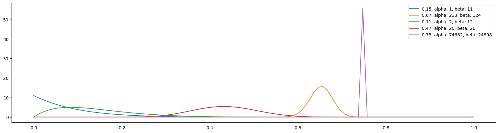

It is also interesting to look at what happened after only 100 visitors:

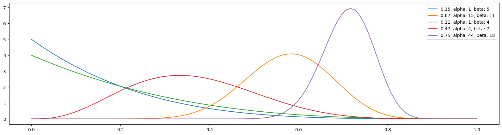

Two differences between `Thompson Sampling` and the other algorithms we have discussed should be noted. First, as already mentioned, `Thompson Sampling` attempts to build a distribution for the bandits. Comparing the two visuals from 100 visitors and all visitors shows that, although the best version has jumped out early, the distribution is much tighter/narrower at the end of the experiment, indicating greater "confidence" for the estimated expected win rate. Second, and importantly, the `Thompson Sampling` algorithm has no problem distinguishing between a bandit with a 0.67 win rate and the best version with a win rate of 0.75.

## Comparing the Algorithms

It is important to compare the five algorithms in various settings. Following Sutton and Barto (2020), we conduct a 5-armed testbed. The idea of the testbed is to run the algorithms many times, say 2,000, then calculates the success rate, which is the percentage that the best bandit was picked in each round. For example, suppose we run the `Epsilon Greedy` algorithm 2,000 times with different win rates. We look at the bandit picked on the 100th visitor and found that, out of the 2,000 runs the best bandit was picked 800 times. Then at the 100th round/visitor, the success rate was 0.4. When we developed the `BayesianAB` class, we were already anticipating the implementation of the testbed. Specifically, in the following functions/methods:
* `update()`
* `gradient_bandit()`
* `bayesian_bandits()`

there is

```python
self.history_bandit.append(i)
```

which records the which bandit was picked at each round. The parameters `p_max`, `p_diff`, and `p_min` also allow the `BayesianAB` class to generate different win rates. We will now develop a script to implement the testbed where the `BayesianAB` class is imported and called:

```python
import numpy as np
import pandas as pd
import matplotlib.pyplot as plt
import seaborn as sns
from multiprocessing import Pool, cpu_count
from functools import partial

from bayesianab import BayesianAB

# set the number of bandits
N_bandits = 5
# set the number of visitors
N = 10001
# set the number of trials
M = 2000


def worker(algo, number_of_bandits, number_of_trials, p_max, p_diff, p_min, n):
    bayesianab_instance = BayesianAB(number_of_bandits, number_of_trials, p_max, p_diff, p_min)
    getattr(bayesianab_instance, algo)()
    return bayesianab_instance.history_bandit


def monte_carlo(
        algos,
        m=500,
        n=10001,
        p_max: float = .75,
        p_diff: float = .05,
        p_min: float = .1
):
    algos_hist = {algo: [] for algo in algos}

    for algo in algos:
        print(f'Running {algo}...')
        with Pool(cpu_count()) as pool:
            func = partial(worker, algo, N_bandits, n, p_max, p_diff, p_min)
            results = list(pool.imap(func, range(m)))

        algos_hist[algo] = results

    return algos_hist


def run_monte_carlo(
        algos,
        m,
        n,
        p_values,
):
    trials = {}
    df_all = {}

    for i in range(len(p_values)):
        print(f'The p_values are {p_values[i]}')
        trials[f'p{i}'] = monte_carlo(algos,
                                      m,
                                      n,
                                      p_values[i][0],
                                      p_values[i][1],
                                      p_values[i][2],)

    for i in range(len(p_values)):
        df = pd.DataFrame()
        for j in algos:
            lst = [0] * (N - 1)
            for k in range(M):
                lst = np.array(lst) + np.array([1 if x == 4 else 0 for x in trials[f'p{i}'][j][k]])
            df[j] = (lst / M).tolist()

        df_all[f'p{i}'] = df.copy()

    return df_all


def plot_monte_carlo(
        df_all,
        algos,
        col,
        row,
):
    figure, axis = plt.subplots(row, col, figsize=(20, 10))
    colors = sns.color_palette("Set2", len(algos))

    m = 0  # column index
    n = 0  # row index

    for key in df_all:
        ax = axis[n, m]
        for i in range(len(algos)):
            sns.lineplot(x=df_all[key].index, y=df_all[key][algos[i]], linewidth=0.5, color=colors[i], ax=ax)

        ax.set_ylabel('')
        ax.set_title(prob_list[n * 3 + m])
        ax.set_xticks([])

        if m == 2:
            # Create custom legend using prob_true and colors
            custom_legend = [plt.Line2D([], [], color=colors[i], label=algos[i]) for i in range(len(algos))]
            ax.legend(handles=custom_legend, loc='upper left', fontsize=9)
            n += 1
            m = 0
        else:
            m += 1

    figure.suptitle('Comparing 5 Algorithms in 12 Different Win Rate Specifications', fontsize=16)

    # Adjust the spacing between subplots
    plt.tight_layout()

    plt.savefig("comparison.png", dpi=300)
    # plt.show()


if __name__ == "__main__":
    algorithms = ['epsilon_greedy', 'optim_init_val', 'ucb1', 'gradient_bandit', 'bayesian_bandits']
    prob_list = [[.35, .1, .1], [.35, .05, .1], [.35, .01, .1],
                 [.75, .1, .1], [.75, .05, .1], [.75, .01, .1],
                 [.75, .1, .62], [.75, .05, .62], [.75, .01, .62],
                 [.95, .1, .82], [.95, .05, .82], [.95, .01, .82],
                 ]

    results_df = run_monte_carlo(algorithms, M, N, prob_list)

    plot_monte_carlo(results_df, algorithms, 3, 4)
```

Some explanations may be instructive. First, since we will be calling the same functions many times, we should use parallelization, which is through the `multiprocessing` library. In the script, the `worker()` function defines the task (or worker) for parallelization. The core function in the script, `monte_carlo()`, accepts six arguments:
1. `algos` contains a list of algorithms. The algorithms should match the names given as methods in the `BayesianAB` class. In our case, we have
```python
algorithms = ['epsilon_greedy', 'optim_init_val', 'ucb1', 'gradient_bandit', 'bayesian_bandits']
```
2. `m` is the number of simulations/trials to run. The default value is 500. We will actually be running 2000 simulations;
3. `n` is the number of rounds/visitors in each simulation. A default value of 10001 means it will have 10000 visitors;
4. `p_max` is the highest win rate;
5. `p_diff` is the smallest possible difference between the highest win rate and the second highest win rate;
6. `p_min` is the lowest possible win rate.

We will run simulations with 12 different combinations of `p_max`, `p_diff`, and `p_min`, given in the following list:

```
    prob_list = [[.35, .1, .1], [.35, .05, .1], [.35, .01, .1],
                 [.75, .1, .1], [.75, .05, .1], [.75, .01, .1],
                 [.75, .1, .62], [.75, .05, .62], [.75, .01, .62],
                 [.95, .1, .82], [.95, .05, .82], [.95, .01, .82],
                 ]
```

The `run_monte_carlo()` function calls the `monte_carlo()` function, then processes the results and calculate success rate in each round. The results are stored in a `dictionary` named `df_all`.

The `plot_monte_carlo()` function, as the name suggests, plots the results in a 4-by-3 grid. Each subplot corresponds to a certain combination of `[p_max, p_diff, p_min]` which is the titles of the subplots.

Here is the resulted plot with 2,000 simulations, each with 10,000 rounds/visitors:

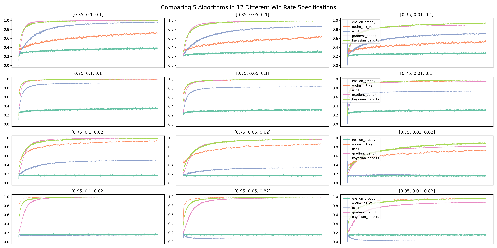

Several results are worth mentioning:
1. `Thompson Sampling` and `Gradient Bandit` both do consistently well. `Thompson Sampling` has the best overall performance, picking the best bandit in over 90% of the simulations at the end of 10,000 rounds. It also edged out `Gradient Bandit` when `p_diff` is 0.01, which means there can be a close second-best bandit;
2. The `Epsilon Greedy` algorithm performs consistently regardless of win rate settings, but at a poor 20% success rate at picking the best bandit. This may be partly due to a relatively high value of epsilon at 0.5;
3. The algorithm that is the most sensitive to win rate settings is `UCB1`. When the win rate of the best bandit is at 0.95, `UCB1`'s performance can be puzzling. In part, it may be a the result of a relatively high `c` value, since the default is 1. Intuitively, when the best bandit has a win rate of 0.95, and especially when there exists a close second-best, the "bonus" that `UCB1` can give to a bandit is small. After all, the win rate is not to be exceeding 1. As a result, `UCB1` has a hard time distinguishing between the best bandits and others that are almost as good. It should be noted that `UCB` (not `UCB1`) has the best performance in the testbed in Sutton and Barto (2020), but the authors also acknowledged that `UCB`'s application beyond the Multi-Armed Bandit problem is limited (in the context of reinforcement learning).

## Summary and Extensions

In this article, we have introduced five algorithms that can be used in *real-time* A/B Testing and Randomized Controlled Trials. Compared to traditional methods that often use Power Analysis to determine the minimum sample size, algorithms introduced in this article have one additional advantage: They can be easily extended to experiments with more than 2 choices/versions/bandits, as shown throughout the article.

The algorithms introduced in this article are known as algorithms for the `Multi-Armed Bandit` problem, which is considered as the simplest form of **reinforcement learning**. We will come back to more reinforcement learning algorithms and problems in later articles.

Two extensions of the `Multi-Armed Bandit` problem should be mentioned: `Non-stationary Bandit` and `Contextual Bandit`. Non-stationary Bandit is the situation in which that the win rates change over time. One particular algorithm that we introduced in this article is known to do badly in non-stationary bandit problems: `Optimistic Initial Values`. The reason is obvious. `Optimistic Initial Values` algorithm is designed to explore aggressively in the beginning. When the win rates change after this initial exploration stage has ended, it is hard for it to change course.

As the name suggested, `Contextual Bandit` means that there exists contextual information to be used when making a decision. In a simple example, a casino may have slot machines in different colors, and the colors are not random: the green machines have higher win rates than the red ones. A new player would not know that information at first, but as time goes on and if the player has explored enough, it is possible to figure out the *association* between color and win rate, and hence decisions are made accordingly. This is also why `Contextual Bandit` is also known as `Associative Search`. We will come back to this in another article, since `Contextual Bandit` algorithms can be used in regression problems.

(Visit my GitHub for the latest Python scripts: https://github.com/DataHurdler/Econ-ML/tree/main/Multi-Arm%20Bandits)

## References

* https://www.udemy.com/course/bayesian-machine-learning-in-python-ab-testing/
* http://incompleteideas.net/book/the-book-2nd.html (Chapter 2)
* https://en.m.wikipedia.org/wiki/Multi-armed_bandit
* https://www.tensorflow.org/agents/tutorials/intro_bandit
