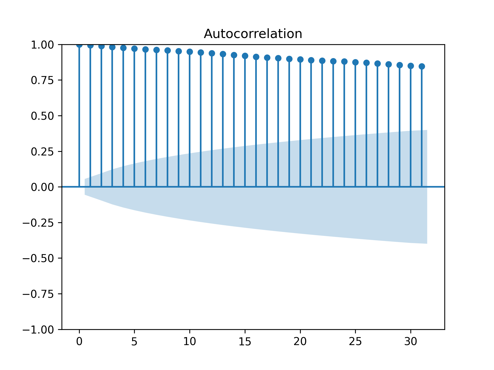
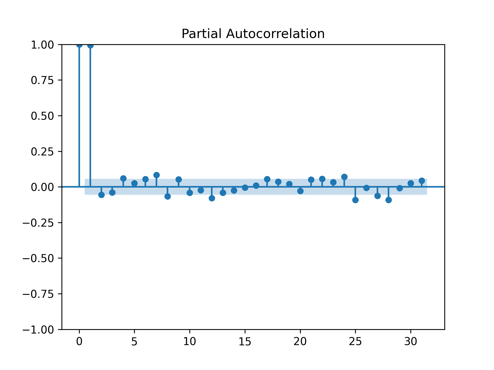
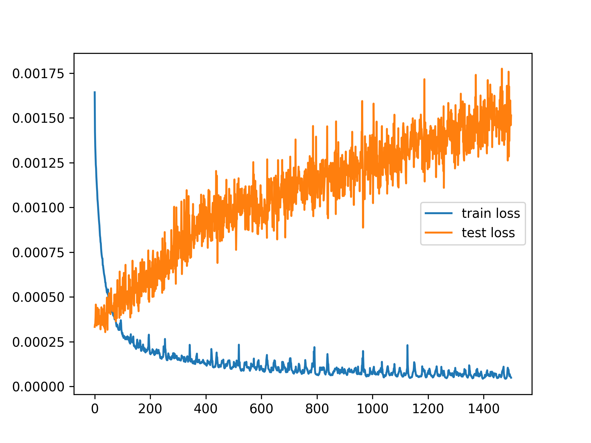
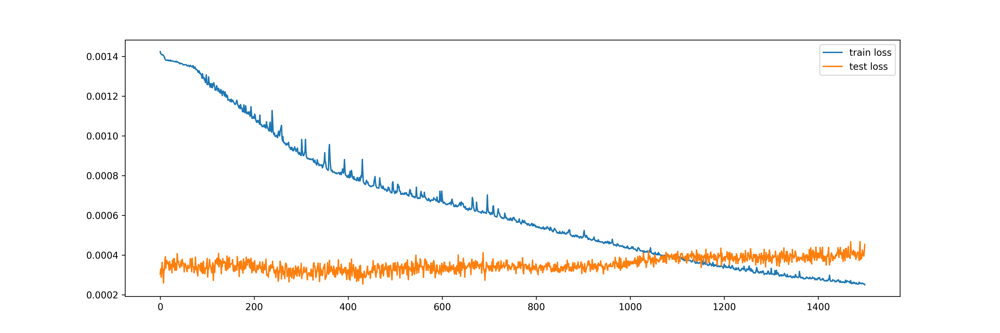
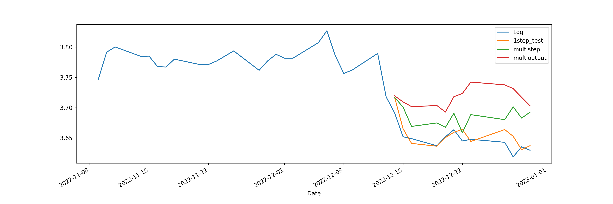
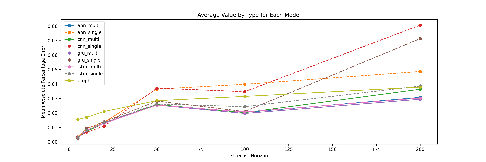
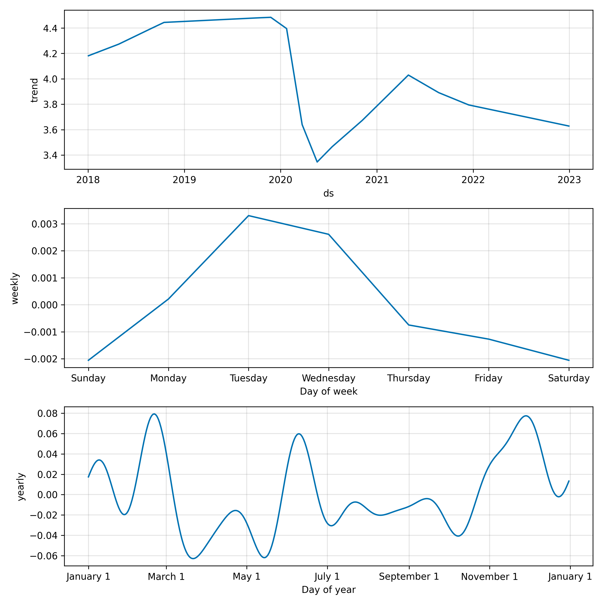
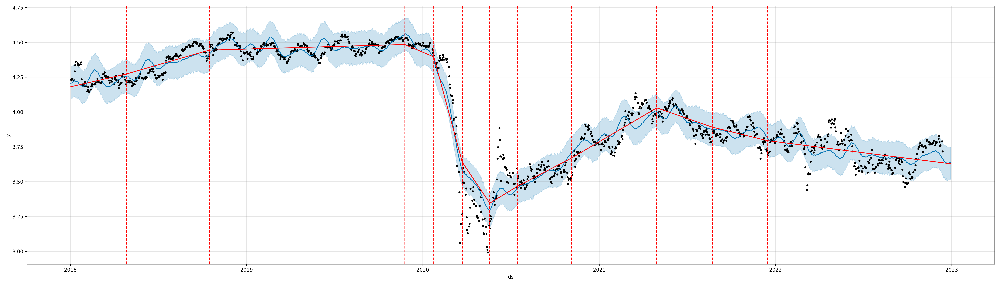
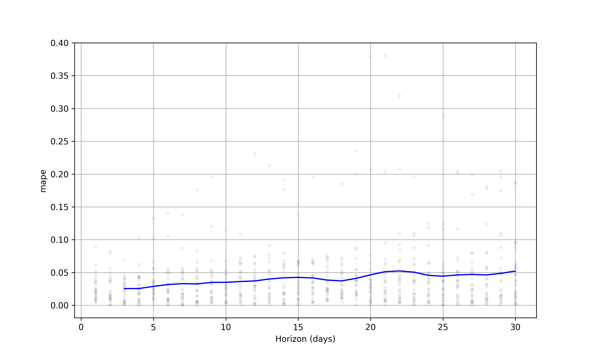

# Time Series, Forecasting, and Deep Learning Algorithms

## Introduction

This chapter is structured differently from other chapters. We will begin with Python implementations for time-series/forecasting models that are not machine learning based. This is accomplished primarily with the Python library `statsmodels`. The section serves as both a review of forecasting concepts and an introduction to the `statsmodels` library, another widely used Python library for statistical/data analysis.

The main emphasis of this chapter, however, is the use of `deep learning` models for forecasting tasks. We will introduce three neural network models: `Artificial Neural Networks` (ANN), `Reccurent Neural Networks` (RNN), and `Convolutional Neural Networks` (CNN). We will implement these models in Python using `Keras` from TensorFlow`. The chapter ends with the introduction to `Facebook`'s `Prophet` library, which is a widely-used library for forecasting in the industry.

**Forecasting** should need no introduction. At its simplest form, you have a time series data set with values of a single object/individual overtime, and you attempt to predict the "next" value into the future. In more complicated cases, you may have covariates/features, as long as these features are observable at the moment of forecasting and do not result in **information leakage**. For example, if you are doing weather forecast and your goal is to forecast whether it is going to rain tomorrow, your data set should contain only information of whether it has rained or not in the past many days in which additional features such as temperature, dew point, and precipitation may be included. These additional weather variables should be from the day before your forecast, not the day of your forecast, when you are training your model. A classic example of information leakage happens when forecasting with moving average (MA) values. For example, if you are doing a 3-day MA, then the value of today requires the use of the value from tomorrow, which is only possible in historic data but not with real data.

## Time Series Implementation in `statsmodels`

In this section, we will implement three forecasting models: `Exponential Smoothing (ETS)`, `Vector Autoregression (VAR)`, and `Autoregressive Integrated Moving Average (ARIMA)`. ETS and ARIMA are run with a single time series, whereas VAR uses several. The data set we will use is U.S. stock exchange (close) prices from the Python library `yfinance`. For ETS, we will also implement a walk-forward validation, which is the correct form of validation for time series data, analogue to cross validation seen in the last chapter. To show the power of Auto Machine Learning, we will implement auto ARIMA from the Python library `pmdarima`. Here is the full Python script:

```{python 'ts_statsmodels.py', eval=F, file="https://raw.githubusercontent.com/DataHurdler/Econ-ML/main/Forecasting/ts_statsmodels.py"}
```

As in other chapters, a `class`, named `StocksForecast`, is written. In the beginning of the script, we have two static methods/functions outside of the class for data preparation and plotting. For `StockForecast`, we initiate the class with:

1. download the data
2. store data into a `dictionary` with each stock in a different key
3. calculate the log and first-differenced values of `close price`.

```{python 'def __init__', eval=F, code = readLines("https://raw.githubusercontent.com/DataHurdler/Econ-ML/main/Forecasting/ts_statsmodels.py")[59:74]}
```

Each model is implemented inside a wrapper function. For example, the ETS implementation is in `run_ets()`, which does the following:

1. call the `prepare_data()` function
2. instantiate the `ExponentialSmoothing` model from `statsmodels` with hyperparameters `trend`, `seasonal`, and `seasonal_periods`. For `trend` and `seasonal`, `mul` means these trends are multiplicative. The value 252 (days) is used for `seasonal_periods` since this is about the number of trading days in half a year
3. call `model.fit()`
4. get forecast columns and prepare the data for plotting
5. call the `plot_fitted_forecast()` function to plot

```{python 'def run_ets', eval=F, code = readLines("https://raw.githubusercontent.com/DataHurdler/Econ-ML/main/Forecasting/ts_statsmodels.py")[76:99]}
```

A walk-forward validation for ETS is implemented by the method `run_walkforward()` (largely from the Lazy Programmer) which is a wrapper function of `warlkforward_ets()`. For time series data, we can not perform cross-validation by selecting a random subset of observations, as this can result in using future values to predict past value. Instead, a n-step walk-forward validation should be used. Suppose we have data from 1/1/2018 to 12/31/2022, a 1-step walk-forward validation using data from December 2022 would involve the following steps:

1. train the model with data from 1/1/2018 to 11/30/2022
2. with model result, make prediction for 12/1/2022
3. compare the true and predicted values and calculate the error or other desire metric(s)
4. "walk forward" by 1 day, then go back to training the model, i.e., train the model with data from 1/1/2018 to 12/1/2022
5. continue until data from 1/1/2018 to 12/30/2022 is used for training and 12/31/2022 is predicted

We should try several different hyperparameter combinations since the purpose of the walk-forward validation is to choose the "best" hyperparameters. The following lines inside `if __name__ == "__main__":` calls the `run_walkforward()` method to try a combination of hyperparameters, which also prints out the "best" values for `trend` and `seasonal`:

```{python 'walkforward val', eval=F, code = readLines("https://raw.githubusercontent.com/DataHurdler/Econ-ML/main/Forecasting/ts_statsmodels.py")[327:334]}
```

The method `run_var()` runs the VAR model. Since we run VAR with several stocks, standardized/normalized should be performed. This is accomplished in the `prepare_data_var()` method with `StandardScaler()` from scikit-learn. 

Last but not least, the `run_arima()` method runs the Auto ARIMA from the `pdmarima` library. Here, we also call `plot_acf()` and `plot_pacf()` from scikit-learn to examine the autocorrelation and partial autocorrelation functions. Normally, they are important for the ARIMA model. However, with Auto ARIMA, we are spared of the task of manually determine the values of AR() and MA(). Similar to `run_ets()`, there are only a few lines of code:

```{python 'def run_arima', eval=F, code = readLines("https://raw.githubusercontent.com/DataHurdler/Econ-ML/main/Forecasting/ts_statsmodels.py")[261:291]}
```

The plots of ACF and PACF are as follow:




If you would like to run ARIMA from `statsmodels`, you can import `ARIMA` from `statsmodels.tsa.arima.model`. `statsmodels` also provides functions and APIs for other time-series/forecasting methods and models. For example, you can test for stationarity with the augmented Dickey-Fuller unit root test by importing `adfuller` from `statsmodels.tsa.stattools`, or run the Vector Autoregressive Moving Average with exogenous regressors by importing `VARMAX` from `statsmodels.tsa.statespace.varmax`. In addition, if you would like to do the Box-Cox transformation, you can import `boxcox` from `scipy.stats`.

The last method in the `StocksForecast` class produces the following comparison plot. None of the models along performed particularly good. Surprisingly, and now shown in this plot, the average of the three models would predict quite well. This, once again, shows the power of ensemble or meta-learning.


## Artificial Neural Network (ANN)

Similar to other chapters, this chapter assumes that readers have some idea about what a neural network is and what it can do. Our goal is not to give an in-depth introduction to neural networks. Rather, we will only cover elements of neural networks that matter most in their applications in economics and business assuming readers already have some quantitative training. An excellent place that you can "play" with a neural network model is the [Tensorflow Playground](https://playground.tensorflow.org/).

Neural networks can be used on both regression and classification problems. Our focus in this chapter is to use neural networks on regression since the emphasis is forecasting. Keep in mind that we can always reshape a regression problem into a classification problem. For example, instead of forecasting the actual price or return of a stock, we can predict the likelihood of a stock trending up or down, which is a binary classification problem. The difference between applying neural networks on regression or classification problems is minor: for regression problems, the final activation function is an identify function (returns itself) whereas for classification problems it is Sigmoid or other functions that return values between 0 and 1. A really good summary of activation functions is [this answer on stackexchange](https://stats.stackexchange.com/questions/115258/comprehensive-list-of-activation-functions-in-neural-networks-with-pros-cons).

Let us begin with artificial neural network (ANN). For implementation of neural networks, we are using `Keras` (https://keras.io/) from `Tensorflow` (https://www.tensorflow.org/). We will introduce `PyTorch`, another popular deep learning library, in other chapters.

Neural network models intend to mimic the human brain. The basic idea can be described as follow. Imagine you see an ice-cream truck and decide to try an ice-cream that you have not had before. First, you receive multiple signals: you see the brand, shape, color, and possibly smell and ingredients of many ice-creams that you can choose from. These "raw" signals are first passed through the initial layer of neurons, the ones immediately connected to your eyes and noses and other sensory organs. After the initial layer and processing, you recognize different features of many ice-creams, some excites you, some not. In neural science terminology, the outputs from the first layer of neurons have different "action potential". If the action potential passes a certain threshold, it excites you. But such excitement can be both positive and negative. For example, you may recognize there are peanuts in some of the ice-creams cones. While the crunchy cone excites you, you also know that you are allergic to peanuts. Imagine in the second layer, one neuron specializes in recognizing cones and the other peanuts. The output from the first layer would activate both of these two neurons. And hence the name "activation function". This process can continue. A neural network may contain many layers, and each layer many neurons. After passing through all the layers, you have arrived at your decision: A cup with vanilla and strawberry ice-creams and chocolate chips on top.

Suppose your raw data set has $N$ observations/rows and $M$ features/columns. The probability of the $i$'s neuron in the first layer being activated is

$$z^{(1)}_i=p(\text{activated} \mid x)=\sigma(xW^{(1)}_i+b^{(1)}_i)$$

where $x$ is a $N\times M$ matrix, $W^{(1)}_i$ and $b^{(1)}_i$ are both vectors of size $M$, and $\sigma()$ is an activation function that returns a probability such as Sigmoid or ReLU. In regression terminology, $W^{(1)}_i$ are the coefficients and $b^{(1)}_i$ is the intercept. By neural network convention, we use the superscript $(j)$ to denote layer.

Usually each layer has multiple neurons. In this case, the outputs $z^{(j)}_i$ can be "stacked" horizontally and fed into the next lay. We an similarly stack $W^{(j)}_i$ and $b^{(j)}_i$. In other words, the number of neurons in the current layer ($j$) is the number of features for the next layer layer ($j+1$). With this, we can express the whole neural network in the following manner:

- Beginning ($j=1$): $z^{(1)}=\sigma(xW^{(1)}+b^{(1)})$
- Hidden layers ($1<j<J$): $z^{(j)}=\sigma(z^{(j-1)}W^{(j)}+b^{(j)})$
- Final layer ($j=J$): $\hat{y}=z^{(L-1)}W^{(L)}+b^{(L)}$

where $J$ denotes the total number of layers, and $\hat{y}$ is the prediction. Note that the final layer does not have an activation function here because we are dealing with a regression model.

While Sigmoid is a widely used function when probabilities are to be predicted, it suffers from the [vanishing gradient problem](https://en.wikipedia.org/wiki/Vanishing_gradient_problem) especially with deep (many layers) neural networks. Modern deep learning models often use `ReLU` or `tanh` as the activation function for inner layers. Again, see [this answer on stackexchange](https://stats.stackexchange.com/questions/115258/comprehensive-list-of-activation-functions-in-neural-networks-with-pros-cons) for the pros and cons of different activation functions in neural networks.

## Recurrent Neural Network (RNN)

There is a compelling reason why `Recurrent Neural Network` (RNN) models are often expected to perform well in time-series/forecasting tasks: it is the neural network version of the autoregressive (AR) process. in its simplest form, often referred to as `Simple RNN`, the output from the hidden layers of time $t-1$ is used as inputs for time $t$ in addition to $x$.

Suppose you only care about one-step forecast, i.e., you want to predict $t+1$ with data up to time $t$. Suppose we use all data for training, the approaches covered in this chapter so far have basically the same flavor: specify a single model for any length of time, train the model using data up to time $t$, and make the prediction for $t+1$. Even with walk-forward validation, it is not much different except that several values of $t$ are considered and hence the model was trained on different data and can have different parameters dependent on the value of $t$.

Having a single unified model is often fine as long as the time series does not have large ups and downs. Unfortunately, economics and business time-series data only consists of ups and downs, such as a recession. In such cases, we often want to specify more than one model. That can be accomplished manually if we know exactly when a structural break has happened.

But life is a box of chocolates and every hour/day is different. It would be nice that a model can do the following: that it "remembers" the past and customizes a model for the current time.

RNN does exactly that. Concretely, let $h_t$ denote the *hidden state* of an RNN at time $t$, we have

$$h_t = \sigma(h_{t-1}W_{ht} + x_tW_{xt}+b_{t})$$

where $W_{ht}$ and $W_{xt}$ are coefficients/weights for the hidden state and input $x_t$, respectively, at time $t$, and $b_{t}(= b_{ht} + b_{xt})$ is the intercept. The hidden state allows the model to "remember" the past and adds non-linear complexity to each time period. It should be noted that $h_t$ can be a mini ANN with many hidden layers.

In addition to Simple RNN, `Long Short-Term Member` (LSTM) and `Gated Recurrent Units` (GRU) are two widely used RNN models. Both models modified how hidden state is being remembered from one time period (or one state) to another. For GRU, two "gates" are introduced:

- Update gate: $z_t = \sigma(x_tW_{xzt}+h_{t-1}W_{hzt}+b_{zt})$
- Reset gate: $r_t = \sigma(x_tW_{xrt}+h_{t-1}W_{hrt}+b_{rt})$

And the hidden state is updated according to

$$h_t = (1-z_t)\odot h_{t-1} + z_t\odot \omega(x_tW_{xht}+(r_t\odot h_{t-1})W_{hht}+b_{ht})$$

where $\odot$ is an element-wise multiplication and $\omega()$ is an activation function similar to $\sigma()$ except that in Tensorflow the default is `tanh` instead of Sigmoid for RNN. In the GRU, $z_t$ controls how much the neural network "forgets" and $r_t$ controls how much the neural network "learns" from the previous state. If $z_t=0$, then the neural network forgets about the previous state (since $1-z_t=0$) and relearn. Keep in mind that the relearn, which is $\omega()$ still consists of the previous hidden state $h_{t-1}$ unless $r_t$ is also equal to 0.

For LSTM, we introduce a new state called `cell state` in addition to the hidden state. In practice, the cell state is an intermediate value that helps to keep track of the model is not included in calculating the final output. The LSTM has three gates:

- Forget gate: $f_t = \sigma(x_tW_{xft}+h_{t-1}W_{hft}+b_{ft})$
- Input/Update gate: $i_t = \sigma(x_tW_{xit}+h_{t-1}W_{hit}+b_{it})$
- Output gate: $o_t = \sigma(x_tW_{xot}+h_{t-1}W_{hot}+b_{ot})$

And the hidden state and cell state ($c_t$) are updated according to:

- Cell state: $c_t = f_t\odot c_{t-1} + i_t\odot \omega(x_tW_{xct}+h_{t-1}W_{hct}+b_{ct})$
- Hidden state: $h_t = o_t\odot \psi(c_t)$

Note that in Tensorflow, the activation function $\omega()$ and $\psi()$ can not be specified individually and are both defaulted to tanh.

## Convolutional Neural Network (CNN)

`Convolutional Neural Network` (CNN) is another deep learning algorithm that we can connect to traditional time-series/forecasting methods easily. Consider a typical ARIMA model, which has three parameters: $p$, $q$, and $d$. These parameters dictates the number of periods in, respectively, autoregressive, moving average, and differencing. An alternative way to look at the ARIMA model is that the original time series data is transformed based on the three parameters.

There are other transformations and filters performed on time-series data, for example, Fourier transformation, low-pass filter, Baxter-King filter, to name a few. Exponential smoothing, which we have shown its implementation using `statsmodels` earlier, is also a filter. Differencing and autoregressive process are also filters.

Which brings us to CNN: convolving is applying filters on the data. The technical/mathematical details are less important for time-series data, as CNN is a widely used algorithm in computer vision (CV) and there are more nuances in that area. For our purpose, let us focus on the following aspects of CNN.

First, convolution does pattern matching/finding with cross-correlation. Imagine a time-series with length $T=10$:

$$ts = [1, 4, 5, 3, 3, 4, 2, 3, 5, 3]$$

and another vector of length $K=3$:

$$c = [1, 5, 1]$$

When we convolved $ts$ with $c$, we are "sliding" $c$ over $ts$ and at each position, we compute the dot product. For example, when $c$ is overlaid on the first three values of $ts$, we have:

$$[1, 5, 1] \cdot [1, 4, 5]=(1\times1)+(5\times4)+(1\times5)=26$$

Repeating this process, we get a convolved version of $ts$:

$$tsv = [26, 32, 23, 22, 25, 17, 22, 31]$$

The resulted new vector is of size $T-K+1$, which is the `valid` mode of convolution. If we want the resulted vector to be the same size as the original, we are performing a `same` mode convolution and we need to add padding of size $K-1$. In our example, we can add two zeros to the original time series then do the convolution:

$$tsz = [0, 1, 4, 5, 3, 3, 4, 5, 6, 5, 3, 0]$$

How is convolution pattern matching/finding? In the above example, it easy to see that the filter $c$ has the pattern [low, high low]. In the above example, at locations 2nd and 6th, we have

$$ts_2 = [4, 5, 3]; \ ts_6 = [4, 2, 3]$$

The only difference is the value in the middle. It it straightforward to realize that the filter $c$ helps to identify a pattern that has [low, high, low] since $c \cdot ts_2 > c \cdot ts_6$.

But there is more. If we look at $tsv$, we notice the two highest values are at locations 2nd and 8th:

$$ts_2 = [4, 5, 3]; \ ts_8 = [3, 5, 3]$$

They both have the pattern of [low, high, low]. In other words, the filter $c=[1, 5, 1]$ creates a spike in $tsv$ when the pattern in $ts$ is [low, high, low].

In a Euclidean space, the dot product of two vectors can be expressed as

$$a \cdot b = ||a|| \times ||b|| \times \cos{\theta_{ab}}$$

where $||a||$ and $||b||$ are the magnitude of the two products and $\theta_{ab}$ is the angle between $a$ and $b$. Since $\cos{(0)}=1$, $\cos{(\pi/2)} = 0$, and $\cos{(\pi)}=-1$, the dot product not only measures the magnitudes of the two vectors, but also their correlations. Take an extreme example: when the angle between them is $\pi$, they are orthogonal and the dot product is equal to zero no matter the magnitude.

To summarize what we have discussed so far, we say that convolution is cross-correlation. When the segment of the data is highly correlates to the filter, it creates a spike in value and hence indicates a certain pattern.

Second, convolution reduces the number of parameters of the model. Let's go back to the example above. Suppose you hypothesize that there is a 3-day pattern in the data, which actually prompted the use of a filter with size 3. If you want to look at all windows of size 3 in the data, you would be looking at 8 of such windows and a total of 24 parameters, 1 for each day in each window. By using convolution and the sliding filter, you only need 3 filters: the size of the filter. This is not much of a saving in our example, but imagine the case of images, and the difference is huge.

By using the filter sliding through the data, we have stopped to care where the pattern happens, but only that it has happened. This is called `translational invariance`, which is important, again, in computer vision. Imagine you have two pictures of the same cat in the same posture from the same angle, except one of them the cat is on the floor and the other up on the table. It is the same cat. Your filter should be finding the cat, and it should not care where the cat is.

Translational invariance is not as prominent in time-series data, but here is one example with our stock price data: suppose every time a stock's price goes up by more than 10% in a single day, it will follow with a decline; but if the hike is less than 5%, it will follow with another hike. This is a pattern that a filter (or two) should be able to match. And it does not matter when (in analagous to where in CV) it happens.

Third, and before we move on to code, we should introduce two related concepts in CNN: pooling and feature maps. Pooling reduces the size of the data. Continue with our example above with $ts$ and $c$. Suppose we do a `full` mode convolution, i.e., sliding $c$ over $tsz$, then we have the new convolved series as:

$$tsf = [9, 26, 32, 23, 22, 25, 17, 22, 31, 20]$$

we can perform `max` pooling on $tsf$ to reduce its size to 5. What we do is to group every two numbers, then pick the highest number from the group:

$tsfp = [\{9, 26\}, \{32, 23\}, \{22, 25\}, \{17, 22\}, \{31, 20\}]$

$tsfp = [26, 32, 25, 22, 31]$

The other way to do pooling is `average` pooling, but max pooling is more intuitive. At a high level, pooling, especially max pooling, does two things: it reduces the size of the data but preserves the "spikes". In other words, this is another operation of "we do not care where/when as long as it happens".

By convention, even though pooling has reduced the size of the data, filter size remains the same. In other words, if we overlay $c$ on $tsfp$, at the first location ($tsfp_1 = [26, 32, 25]$), $c$ is now finding patterns from the first 7 numbers in $ts$. To see this, note that the value 25 in $tsfp_1$ was calculated by

$$[1, 5, 1] \cdot ts_5 \Rightarrow [1, 5, 1] \cdot [3, 4, 5]$$

where the value 5 in $ts_5$ is the 7th value of $ts$. In other words, with pooling and same size filters, CNN is able to see bigger and bigger "pictures" when data is passed through the convolution layers.

However, it is important to increase the number of filters after each pooling until the size of the feature map is large enough. A `feature map` is a collection of features. It has a pictorial name because CNN was first developed for computer vision. The reason for the increasing size of feature map is straightforward: as data goes through the convolution layers, the filters are search wider and wider due to pooling. Increasing the number of features/filters would allow the CNN to look deeper. This helps to preserve information while transformation is happening. For time-series data, instead of a long time series, we can think of the data output from the convolution layers as a stack of many moments.

After going through the convolution (and pooling) layers, the output is fed into some `Dense` layers just like ANN. In a way, we can think of CNN as two-stage feature engineering: convolution layers and Dense layers.

## Deep Learning Algorithms in TensorFlow/Keras

The implementation of ANN, RNN, and CNN are similar when using TensorFlow/Keras. The main difference is in how the hidden layers are constructed, with the minor caveat that the dimensions of input and output data from different models (notably ANN) can be different. As a result, it is important pay attention to the shapes of the arrays or dataframes that we feed or receive. In the following script, you will see places where it performs such checks. Otherwise, the three functions in the beginning of the script are the only differences in how these models are constructed in Keras:

```{python 'ts_tensorflow.py', eval=F, file='https://raw.githubusercontent.com/DataHurdler/Econ-ML/main/Forecasting/ts_tensorflow.py'}
```

The class we create in this script is named `StocksForecastDL`, as we continue to the use stock prices as an example. Stock prices are not the best example to be used in forecasting, as they resemble "random walks", but they are important in financial engineering and other related topics. As already mentioned, in the beginning of the script are three functions that provide the different constructs of the three models. For ANN, there are only `Dense` layers. In our example, we use two hidden layers each with 32 hidden units by default. For RNN, we need to specify which one of the three models we would like to implement and replace the `Dense` layers in the ANN by the relevant RNN layers. In each case, we implement two RNN layers with 32 hidden units, which is why `return_sequences` is set to `True` in the first RNN layer. For CNN, we replace `Dense` with `Conv1D` since we have a time-series data. If you are using CNN on images, you would likely be using `Conv2D`. The "Conv" layer should be followed by a Pooling layer. In this case, we use `GlobalMaxPooling1D`. As was discussed in the theory section, the size of feature map should increased from one lay to another. In our example, the first CNN layer has 16 features whereas that of the second layer is increased to 32:

```{python 'def ann/rnn/cnn', eval=F, code = readLines("https://raw.githubusercontent.com/DataHurdler/Econ-ML/main/Forecasting/ts_tensorflow.py")[15:77]}
```

In the `StocksForecastDL` class, we have the following methods after the class is initialized: `prepare_data()`, `make_predictions()`, `run_forecast()`, and, finally, `single_model_comparison()`. These methods are self-explanatory by their names. It is worth noting that the `run_forecast()` method accepts an input named `multistep` which is a Boolean value. Suppose our forecast horizon is 15 days. When `multioutput=False`, we use a single-step model to forecast the next 15 days. That is, the model predicts the first day, then use that prediction in the prediction of the second day, and so on. If we set `multioutput=True`, the model will predict all 15 days at once, given information available on the day before. The `single_model_comparison()` method can be called to compare these two (single- versus multi-output) forecasts for a deep learning model such as ANN or LSTM.

The number of epochs is an important hyperparameter when it comes to deep learning models. Practitioners often plot the losses from training and validation/test data sets to examine if the algorithm has "converged" or if over-fitting has happened. Below are such plots from ANN and LSTM for the single-step forecast models with 1500 epochs. Both show some evidence of over-fitting, especially ANN, as the test/validation loss continues to increase while the train loss stays flat after about 600 epochs:




Comparatively, for the multi-output model using LSTM, 1500 epochs seems to be ideal, as train loss continues to lower and the test/validation loss stays flat:



Another important parameter in our script is value of `t`, which is given a default value of 10 when the `StockForecastDL` class is initiated. This is the size of the training data set for these deep learning models. Or equivalently, you can think that the number of features is 10. Suppose the algorithm is attempting to predict the stock price for February 20, 2023, which is a Monday, it uses stock prices from February 6 (Monday) to February 17 (Friday) as its inputs. Increasing the number `t` has two opposite effect on model training and prediction. On the one hand, it makes the data set wider, which allows the model to be trained with more features. On the other hand, it makes the data set shorter, as more days in the beginning of the data set need to be reserved for training. Imagine you have the time series for 360 days. If `t=10`, then your data set has 11 columns (10 features and 1 outcome) and 350 rows. But if `t=180`, then your data set has 181 columns (180 features and 1 output) but only 180 rows. In general, time series models favor longer rather than wider data. In our example, I have increased the value of `t` to 20 and the results are quite similar.

For the deep learning models, we conduct two types of comparisons. First, as already mentioned, we compare multi-step forecasts from the single-step and the multi-output models. Here is the comparison for CNN:



In the graph, "Log" is original data series, "1step_test" is one-step forecast from the single-step model, i.e., each prediction uses the true historical data, "multistep" is multi-period forecast from the single-step model as described earlier, and "multioutput" is from the multi-output CNN model by setting `multioutput=True`, i.e., all 20 days are predicted at the same time. The one-step forecast is expected to do well, as it forecasts with true information. However, we can also visually see that, at least for CNN, the multi-period ("multistep" on the graph) forecast from the single-step model outperforms the multi-output model.

For a more formal comparison, we run these models with 10 stocks and for 6 different forecast horizons: 5, 10, 20, 50, 100, and 200 days. We calculate the report the averages **mean absolute percentage error** (MAPE) from the 10 stocks. Below is the result. Note that `Prophet`, which we will formally introduce in the next section, is also included:



A smaller value of MAPE indicates better model fit. Not surprisingly, the single-period models outperform the multi-step models when the time horizon is short, but for 50 days and above, the multi-step models are significantly better.

## Facebook's Prophet

Facebook's [Prophet](https://facebook.github.io/prophet/) is a Bayesian model rather than a deep learning model. But it is purposedly built for forecasting. The Prophet is built on top of standard regression techniques and utilizes a decomposable time series model with multiple seasonalities using a Fourier series. It also accepts user-defined holidays making it highly customizable for applications in different regions.

A new model, named [NeuralProphet](https://neuralprophet.com/), has combined Prophet and deep learning. Since it is based on `PyTorch` instead of `TensorFlow`/`Keras`, we will not look at it in this chapter.

Here is the script that we use to implement Prophet on the stock prices. It should be noted that the true power of `Prophet` is in other common business applications rather than stock prices. We continue to use stock prices here just for illustrative purposes:

```{python 'ts_prophet.py', eval=F, file='https://raw.githubusercontent.com/DataHurdler/Econ-ML/main/Forecasting/ts_prophet.py'}
```

In the above script, the stock we used is United Airlines (UAL). Three figures were produced. The first figure shows the several seasonality components considered by the model, which include the overall trend and weekly and yearly seasonality. At least two of th peaks in annual seasonality can be easily explained: one in summer around late June, and another in winter around Thanksgiving.



The second figure shows several change points based on Prophet's algorithm:



The change points made sense as the market for airlines and other travel related stocks has been versatile since spring of 2020 due to COVID-19.

Lastly, we have the figure that shows the value of MAPE for different cross-validation forecast horizons:



## Summary

In this chapter, we discuss the topic of forecasting as a *regression* problem. The word "regression" was emphasized for two reasons. First, the deep learning algorithms discussed in this chapter can be applied to other regression problems. Second, forecasting problems can be classification problems, either by transformation or my the nature of the problem. For example, instead of forecasting stock prices, we can forecast whether prices are going up or trending down. This transformed a regression problem into a classification problem. On the other hand, forecasting whether a customer will continue to pay off mortgage in full is naturally a classification as the outcome can be only "yes" or "no".

While this chapter uses the deep learning models for regression, it should be reminded that they are as powerful in classification problems. The only change that needed to be made, from a coding perspective, is that a activation function that returns a probability needed to be specified in the last `Dense` layer. Popular activation functions are `tanh` and `ReLU`.

The biggest appeal of using neural networks for forecasting tasks is the their ability to perform what we called the **multi-output** forecasts, i.e., train the model to output predictions for multiple periods at once. In our comparison, we saw that when the forecast horizon is long, these multi-output models performed well.

One important aspect of using neural networks for forecasting tasks is the construction of the training data set. We have emphasized the importance of the parameter `t` when we discussed the scripts. This parameter directly affects the width of the training data set, i.e., the number of features, but also indirectly affects the length of the training data set as a bigger `t` value requires more data to be reserved for training in the beginning of the time series.

Traditionally, machine learning algorithms are broadly divided into three categories: supervised learning, unsupervised learning, and reinforcement learning. When we were constructing the training data set in this chapter, we were actually getting started with the fourth type of machine learning: **self-supervised learning**. As its name suggests, self-supervised learning is a kind of supervised learning, but the target and training data set were constructed and optimized by the algorithm itself. In the context of forecasting, a true self-supervised learning algorithm could be one to pick the value `t`, the number of periods to look back, in order to make the best forecasts given other hyperparameters. This simple task may be done by grid search. A more complicated, and likely more real example for self-supervised learning in forecasting is for the algorithm to find the best "look-back" strategy. For example, may be it is best to only look at prices of the past three Fridays'.

Using deep learning models in forecasting is a bit of a overkill, although some of these models, such as LSTM, naturally sounded like they would do a good job in time-series tasks. Deep learning models can really shine in computer vision, voice recognition, and natural language processing (NLP) tasks. Later chapters will have brief coverage of these topics.

## References (incomplete)

* https://www.udemy.com/course/time-series-analysis/
