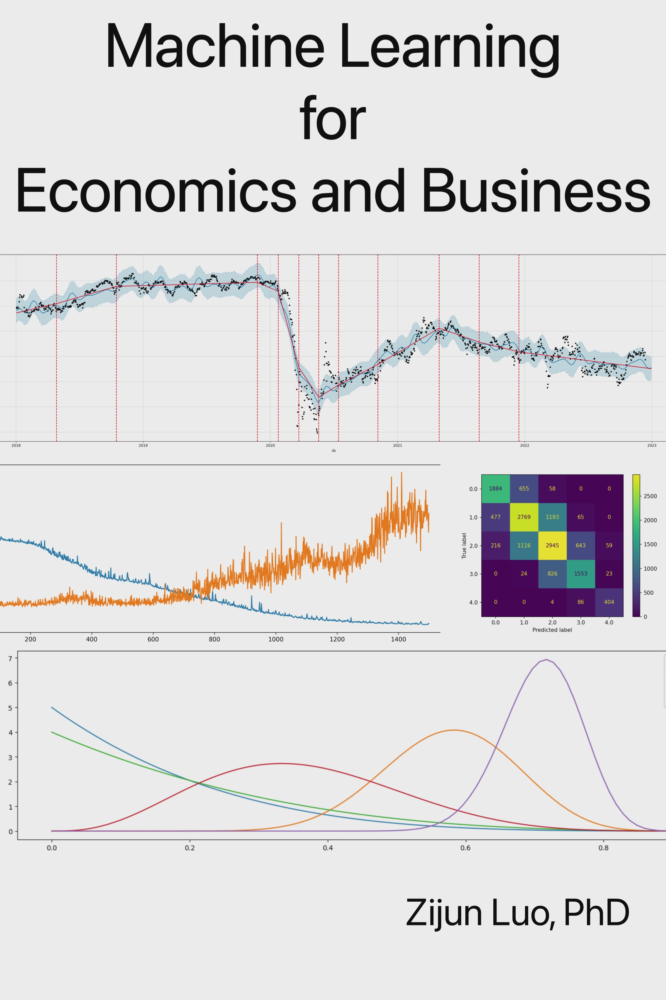

--- 
title: |
  {width=1in}  
  Machine Learning for Economics and Business
# author: "Zijun Luo"
date: "2023-07-14"
site: bookdown::bookdown_site
cover-image: images/cover.jpg
documentclass: book
# bibliography: [book.bib, packages.bib]
url: https://datahurdler.github.io/Econ-ML-Book/
# cover-image: path to the social sharing image like images/cover.jpg
# description: |
#   This is a minimal example of using the bookdown package to write a book.
#   The HTML output format for this example is bookdown::gitbook,
#   set in the _output.yml file.
# link-citations: yes
github-repo: DataHurdler/Econ-ML
---

# Preface {-}

The primary purpose of this book, which I started to write in May 2023, is to review, summarize, and organize what I have learned in Machine Learning as a PhD economist. I have taken several Machine Learning courses on Coursera and Udemy. In 2022, I also worked, briefly, as a data scientist in an AdTech start-up.

Please email me if you see any errors.

## Who Should Read This Book {-}

The intended readers of this book are those already have some quantitative training but are interested in what Machine Learning can offer. The group that would benefit the most from these chapters is graduate students who have had at least one (undergraduate or graduate) course in econometrics with some experience in a scripting language, preferably `Python`. However, anyone who have a solid understanding of regression methods or work with data on a regular basis may find this book to be useful. This is not an introductory book on either Machine Learning or `Python`. My main charges are on Machine Learning algorithms that can provide an alternative, sometimes more useful and rigorous, approach to known problems in economics, business, and social sciences. I try to provide complete, but not overwhelming, treatments on all topics and algorithms. With the provided `Python` scripts, the emphasis is on practicality.

## How to Use This Book {-}

In the online version of this book, found at https://datahurdler.github.io/Econ-ML-Book/, full `Python` scripts are included in each chapter. These full scripts are directly linked to the [GitHub repo](https://github.com/DataHurdler/Econ-ML) that houses these scripts publicly. In the (future) print version of this book, only segments with further explanations are printed. There is currently some consideration to also provide scripts in `R`.

With few exceptions, each chapter starts with applications and examples, followed by theory, then the scripts, and ends with a comparison and the summary. If you are not using `Python` for these tasks, or are not interested in how I implement some of these models, skipping all code blocks should still provide you a pleasant reading experience. I suggest you only skip the code blocks, but continue to read the explanations of the codes because some insights about how the models work can be found in them. For example, I may describe the different functions/methods called in the script and what these calls are supposed to accomplish. Even though you do not care about the actual names of these calls, as you have skipped the code block, it is still important to learn what they do. This is helpful when you develop your own scripts.

If you find the scripts to be distracting, you can also hide them, although most of them are set to "show" by default.

## A Note on References {-}

The references provided in these chapters have not met the high standard I usually hold against them. They truly are just lists of whatever materials that have helped me understanding the topics and hence have contributed to the writing of this book, be it academic papers, YouTube videos, Coursera/Udemy courses, or blog posts. The print version of this book, if ever, may have different references.

<!-- If you need PDF output, uncomment bookdown::pdf_book above in YAML. You will need a LaTeX installation, e.g., https://yihui.name/tinytex/ -->
